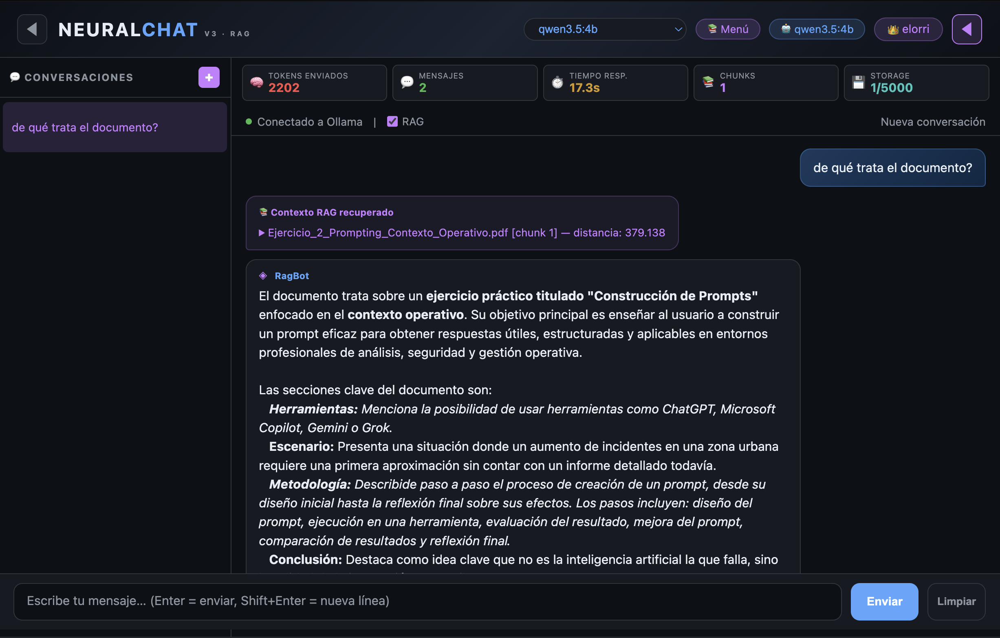
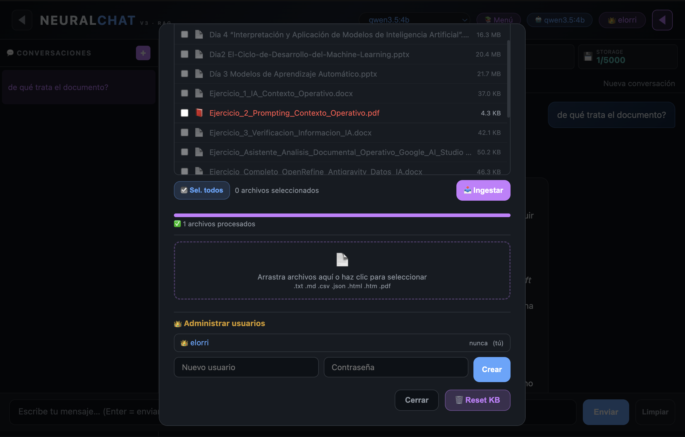

# NeuralChat v3 — Chatbot RAG con Ollama

Chatbot conversacional con Retrieval Augmented Generation (RAG) usando **Ollama** como LLM local, **ChromaDB** como base de datos vectorial e **hilos de conversación persistentes**. 100% local.




## Modelos por defecto

| Rol | Modelo | Notas |
|-----|--------|-------|
| **Chat** | `qwen3.5:4b` | Rápido, sin thinking, respuesta directa en español |
| **Embeddings** | `nomic-embed-text` | Multilingüe (inglés, español, etc.) — 768 dimensiones |

Ambos configurables por variable de entorno.

## Características

- **Chat en streaming** — respuestas en tiempo real con efecto de escritura
- **RAG (Retrieval Augmented Generation)** — el modelo responde usando **solo** el contexto de los documentos que subas
- **Usuarios y autenticación** — registro/login con contraseña. El primer usuario es administrador. Usuarios aislados entre sí
- **Historial persistente** — múltiples conversaciones por usuario guardadas en SQLite. Se restauran al recargar la página
- **Selector de modelo** — elige entre cualquier modelo Ollama instalado sin reiniciar
- **Soporte PDF** — extracción de texto de documentos PDF mediante `pypdf`
- **Explorador de archivos** — navega por carpetas locales, selecciona archivos e ingiérelos directamente
- **Gestión de documentos** — sube archivos `.txt`, `.md`, `.csv`, `.json`, `.html`, `.pdf` y los ingiere automáticamente
- **Borrado selectivo** — elimina documentos individuales sin resetear toda la KB
- **Previsualización** — haz clic en cualquier documento ingerido para ver su contenido
- **Panel de documentos** — columna lateral con todos tus documentos, chunks y previsualización al instante
- **Paneles colapsables** — las columnas de conversaciones y documentos se ocultan/muestran con un clic (estilo NotebookLM)
- **Chunking semántico** — divide por párrafos en lugar de contar palabras ciegamente
- **Embedding paralelo** — genera embeddings de varios chunks a la vez para ingerir más rápido
- **Prompt multilingüe** — el sistema traduce documentos en inglés al responder en español
- **KPI en tiempo real** — tokens, mensajes, tiempo de respuesta, chunks y almacenamiento usado
- **Barra de progreso** — feedback visual al ingerir múltiples archivos
- **Control de almacenamiento** — límite de chunks por usuario (5000 por defecto). Se muestra en los KPIs
- **100% local** — ningún dato sale de tu máquina

## Tecnologías

| Componente | Tecnología |
|---|---|
| LLM | [Ollama](https://ollama.com/) — `qwen3.5:4b` (configurable) |
| Embeddings | Ollama `/api/embeddings` — `nomic-embed-text` (configurable) |
| Base de datos vectorial | [ChromaDB](https://www.trychroma.com/) |
| Servidor web | Flask 3.x — con Jinja2 templates |
| Frontend | Vanilla JS |
| Base de datos relacional | SQLite (usuarios, sesiones, mensajes) |
| Tunneling (opcional) | Cloudflare Argo Tunnel |

## Estructura del proyecto

```
chatbot-app-v2/
├── app.py                 # Flask: rutas HTTP, streaming SSE, auth, gestión RAG
├── rag.py                 # Módulo RAG: ingest, retrieve, embedding, ChromaDB
├── db.py                  # SQLite: usuarios, sesiones, mensajes
├── requirements.txt       # Dependencias Python
├── templates/
│   └── index.html         # Template Jinja2 de la UI
├── static/
│   ├── chat.js            # Frontend completo (auth, sesiones, docs, file browser)
│   └── style.css          # Estilos CSS
├── docs/                  # Documentos de prueba (no sube a git)
├── .chromadb/             # Base vectorial ChromaDB (ignorada en git)
├── neuralchat.db          # Base SQLite de usuarios y mensajes (ignorada en git)
├── .gitignore
└── README.md
```

## Base de datos vectorial — cómo funciona

### El problema que resuelve

Un LLM normal responde con lo que aprendió durante su entrenamiento. Si le preguntas sobre algo que no conoce, inventa una respuesta (alucinación). RAG soluciona esto dando al modelo **solo** la información relevante de tus documentos.

### El flujo completo

```
1. INGEST (indexación)
   Documento (.txt, .md, .html, .pdf...)
         ↓  Limpieza y chunking semántico (por párrafos)
   Chunks de texto
         ↓  Embedding model (Ollama /api/embeddings)
   Vectores de 768 dimensiones (nomic-embed-text)
         ↓  ChromaDB los almacena con metadatos (usuario, fuente)
   Base vectorial

2. RETRIEVAL (búsqueda)
   Pregunta del usuario
         ↓  Modelo de embedding
   Vector de la pregunta
         ↓  ChromaDB busca los 4 chunks más cercanos (filtrados por usuario)
   Contexto relevante

3. GENERATION (respuesta)
   Pregunta + Contexto → Prompt enriquecido → Ollama → Respuesta en español
```

## Requisitos previos

- **Python 3.11 o 3.12** (ChromaDB no soporta Python 3.13+)
- **Ollama** instalado y corriendo (`ollama serve`)
- Modelos descargados:
  ```bash
  ollama pull nomic-embed-text   # embeddings multilingües
  ollama pull qwen3.5:4b         # chat (o el que prefieras)
  ```

## Instalación

### 1. Clonar el repositorio

```bash
git clone https://github.com/Elorri79/neuralchat-rag.git
cd neuralchat-rag
```

### 2. Crear entorno virtual (recomendado)

```bash
python3.11 -m venv .venv
source .venv/bin/activate   # Linux / macOS
# o .venv\Scripts\activate  # Windows
```

### 3. Instalar dependencias

```bash
pip install -r requirements.txt
```

### `requirements.txt`

```
flask>=3.0
chromadb>=1.5
requests>=2.31
pypdf>=4.0
python-dotenv>=1.0
```

## Arranque

```bash
# Terminal 1 — Ollama
ollama serve

# Terminal 2 — Flask
python3 app.py
```

Abrir: [http://localhost:5051](http://localhost:5051)

### Variables de entorno

| Variable | Default | Descripción |
|---|---|---|
| `MODEL` | `qwen3.5:4b` | Modelo para chat |
| `EMBED_MODEL` | `nomic-embed-text` | Modelo para embeddings |
| `OLLAMA_URL` | `http://127.0.0.1:11434` | URL base de Ollama |
| `PORT` | `5051` | Puerto del servidor Flask |
| `SECRET_KEY` | (aleatorio) | Clave secreta de Flask |

Ejemplo con variables:
```bash
MODEL="llama3.2:1b" PORT=8080 python3 app.py
```

## Primer uso

1. Abre `http://localhost:5051`
2. Regístrate con usuario y contraseña — el **primer usuario es administrador**
3. Haz clic en **📚 Menú** para gestionar documentos
4. Arrastra archivos o navega por el explorador de archivos y selecciona
5. Los documentos aparecen en la columna derecha **📄 Documentos**
6. Escribe tu pregunta — el modelo responde usando el contexto de tus documentos
7. Las conversaciones se guardan automáticamente en el panel izquierdo **💬 Conversaciones**

### Panel de administración

Si eres administrador, en el modal 📚 Menú verás una sección **"Administrar usuarios"** donde puedes crear y eliminar usuarios.

### Atajos de teclado

| Tecla | Acción |
|---|---|
| `Enter` | Enviar mensaje |
| `Shift+Enter` | Nueva línea |
| `☰` / `📄` | Ocultar/mostrar paneles laterales |

## Exponer a internet (opcional)

### Con cloudflared (túnel temporal)

```bash
cloudflared tunnel --url http://localhost:5051
```

Te devuelve una URL pública temporal en `trycloudflare.com`. Caduca al cerrar el terminal.

## Configuración avanzada

Los parámetros de chunking se editan en `rag.py`:

```python
COLLECTION = "chatbot_docs"   # nombre de la colección en ChromaDB
CHUNK_SIZE = 500              # ~palabras por chunk
CHUNK_OVERLAP = 50            # solape entre chunks (no usado en chunking semántico)
MAX_WORKERS = 4               # hilos para embedding paralelo
```

El límite de chunks por usuario se configura en `db.py` (columna `max_chunks` en la tabla `users`, por defecto 5000).

## Modo offline (sin internet)

Para ejecutar en una máquina sin acceso a internet:

1. En una máquina con internet, descarga las wheels:
   ```bash
   pip download -r requirements.txt -d ./wheels/
   ```
2. Descarga Chart.js y colócalo en `static/vendor/chart.umd.min.js`
3. En `templates/index.html`, cambia el CDN de Chart.js por:
   ```html
   <script src="{{ url_for('static', filename='vendor/chart.umd.min.js') }}"></script>
   ```
4. Transfiere todo a la máquina offline
5. Instala con `pip install --no-index --find-links=./wheels/ -r requirements.txt`

## Licencia

MIT
